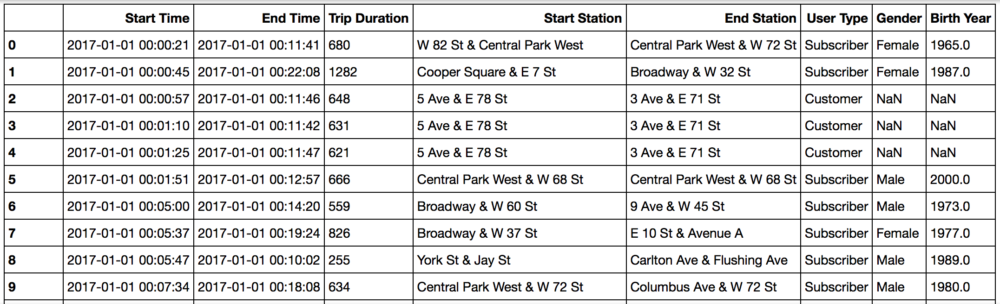

# Project - Explore US Bikeshare Data

In this project, we will make use of Python to explore data related to bike share systems for three major cities in the United States—Chicago, New York City, and Washington. We will write code to import the data and answer interesting questions about it by computing descriptive statistics. We will also write a script that takes in raw input to create an interactive experience in the terminal to present these statistics.

## Overview

### Bike Share Data

Over the past decade, bicycle-sharing systems have been growing in number and popularity in cities across the world. Bicycle-sharing systems allow users to rent bicycles on a very short-term basis for a price. This allows people to borrow a bike from point A and return it at point B, though they can also return it to the same location if they'd like to just go for a ride. Regardless, each bike can serve several users per day.

Thanks to the rise in information technologies, it is easy for a user of the system to access a dock within the system to unlock or return bicycles. These technologies also provide a wealth of data that can be used to explore how these bike-sharing systems are used.

In this project, you will use data provided by Motivate, a bike share system provider for many major cities in the United States, to uncover bike share usage patterns. You will compare the system usage between three large cities: Chicago, New York City, and Washington, DC.

### The Datasets

Randomly selected data for the first six months of 2017 are provided for all three cities. All three of the data files contain the same core six (6) columns:

* Start Time (e.g., 2017-01-01 00:07:57)
* End Time (e.g., 2017-01-01 00:20:53)
* Trip Duration (in seconds - e.g., 776)
* Start Station (e.g., Broadway & Barry Ave)
* End Station (e.g., Sedgwick St & North Ave)
* User Type (Subscriber or Customer)

The Chicago and New York City files also have the following two columns:

* Gender
* Birth Year

**Data for the first 10 rides in the new_york_city.csv file**



### Statistics Computed

You will learn about bike share use in Chicago, New York City, and Washington by computing a variety of descriptive statistics. In this project, you'll write code to provide the following information:

#### Popular times of travel (i.e., occurs most often in the start time)

* most common month
* most common day of week
* most common hour of day

#### Popular stations and trip

* most common start station
* most common end station
* most common trip from start to end (i.e., most frequent combination of start station and end station)
#### Trip duration

* total travel time
* average travel time
#### User info

* counts of each user type
* counts of each gender (only available for NYC and Chicago)
earliest, most recent, most common year of birth (only available for NYC and Chicago)

# Running Project

Make sure Python, Pandas, Numpy is installed on execution machine.

```
$ python bikeshare.py
```

**Taking user choice for city**


**Taking user month and week choice**


**Popular time, stations and trip Statistics**


**Showing raw data**


**Take input to show more raw data and restart analysis with new filter criteria**


(c) Mrityunjay Kumar